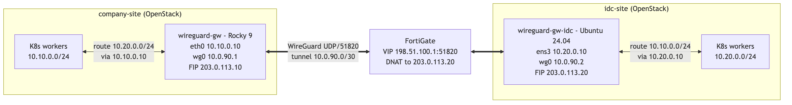

# wireguard-k8s-multisite

[한국어](README.md) | **English**

Site-to-site **WireGuard** overlay that connects two **OpenStack**-hosted Kubernetes
environments across separate physical sites, without installing WireGuard on the
worker nodes themselves.

This repository documents a real-world design pattern: a **dedicated gateway VM per
site** carries the tunnel, and worker nodes join the remote network through that
gateway via static routes — a *gateway model* rather than a per-node mesh.

---

## The problem

Two sites, each running its own OpenStack cloud and a Kubernetes cluster:

- **company-site** — primary site, K8s workers on `10.10.0.0/24`
- **idc-site** — remote IDC, K8s workers on `10.20.0.0/24`

The clusters need L3 reachability between subnets (API access, cross-site service
calls, monitoring), but:

- Worker nodes are plain OpenStack VMs — we don't want WireGuard, IP forwarding, or
  `MASQUERADE` rules on every node (they would interfere with existing
  Neutron/OpenStack internal traffic).
- One site (idc) sits behind a **FortiGate** firewall — no public WireGuard port
  until a DNAT/VIP is configured; the other (company) is reachable on a Floating IP.
- The link must be **independent** of existing public-IP access paths, so it can be
  torn down with zero impact.

## The approach



- A **dedicated gateway VM** at each site terminates the tunnel and owns the
  `MASQUERADE` rules — keeping forwarding off the worker nodes.
- Workers reach the remote subnet through a single **static route** to their local
  gateway, pushed fleet-wide via the OpenStack subnet `host_routes` (DHCP).
- The idc gateway is fronted by a FortiGate **VIP + firewall policy** that DNATs
  inbound WireGuard to its Floating IP; the company gateway is reached directly.

## Why this is non-trivial

Most WireGuard tutorials show a simple 2-peer laptop-to-server link. This pattern
covers the parts that actually bite you in an OpenStack multi-site deployment:

- Gateway-model join (workers run **no** WireGuard) via static routes + source-NAT
- `wg-quick` `PostUp` pitfalls: `nft` vs `iptables`, `POSTROUTING` interface rules
- FortiGate DNAT with `extintf=any` (why a scoped interface drops packets)
- `PersistentKeepalive` when one end sits behind NAT
- Distributing routes via OpenStack `host_routes` instead of per-node config

---

## Repository layout

```
wireguard-k8s-multisite/
├── README.md  /  README.en.md
├── docs/
│   ├── en/                        # English docs
│   │   ├── architecture-overview.md   # design, firewall layers, validation
│   │   ├── network-topology.md        # addressing & route design (diagram)
│   │   ├── packet-flow.md             # per-direction flows (sequence diagrams)
│   │   └── troubleshooting.md         # the real gotchas, with symptoms
│   └── ko/                        # 한국어 문서 (same set)
└── configs/
    ├── wireguard/
    │   ├── company-site-gw.conf   # direct on Floating IP
    │   └── idc-site-gw.conf       # behind FortiGate
    ├── fortigate/
    │   └── dnat-vip.md            # VIP + firewall policy notes
    └── sysctl/
        └── 99-wireguard.conf      # ip_forward + rp_filter
```

## Quick start

1. Provision one small VM per site (e.g. 2 vCPU / 4 GB), one Floating IP each.
2. Fill the placeholders in `configs/wireguard/*.conf` with your real addresses and
   freshly generated keys (`wg genkey | tee privatekey | wg pubkey`).
3. On each gateway: install `wireguard-tools`, apply `configs/sysctl/99-wireguard.conf`, then `systemctl enable --now wg-quick@wg0`.
4. Add the FortiGate VIP/policy from `configs/fortigate/dnat-vip.md` for the gateway
   that sits behind a firewall.
5. Push the static route to workers via OpenStack `host_routes`.
6. Validate with `wg show wg0` and a ping across the tunnel — see [troubleshooting](docs/en/troubleshooting.md).

See [`docs/en/architecture-overview.md`](docs/en/architecture-overview.md) for the full design.

---

## Sanitization note

This repo is derived from a production deployment but contains **no** real
infrastructure data. The following are all placeholders:

| Placeholder | Range / meaning |
|-------------|-----------------|
| `10.10.0.0/24`, `10.20.0.0/24` | site subnets (RFC 1918) |
| `203.0.113.10`, `203.0.113.20` | Floating IPs (RFC 5737 TEST-NET-3) |
| `198.51.100.1` | FortiGate public IP (RFC 5737 TEST-NET-2) |
| `10.0.90.0/30` | WireGuard tunnel subnet (example) |
| all keys | generate your own; never commit private keys |

## License

MIT — see [`LICENSE`](LICENSE).
