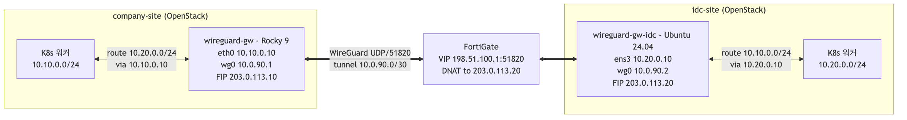

# wireguard-k8s-multisite

**한국어** | [English](README.en.md)

서로 다른 물리 사이트에 위치한 두 **OpenStack** 기반 Kubernetes 환경을, 워커 노드에는
WireGuard를 설치하지 않고 **WireGuard** 사이트 간 오버레이로 연결하는 방법을 정리한
저장소입니다.

여기서 다루는 것은 실제 운영에서 사용한 설계 패턴입니다. **사이트별 전용 게이트웨이
VM**이 터널을 담당하고, 워커 노드는 static route를 통해 그 게이트웨이를 거쳐 원격
네트워크에 접속합니다. 즉 노드마다 WireGuard를 설치하는 메시 방식이 아니라
*게이트웨이 모델*입니다.

---

## 풀려는 문제

각자 OpenStack 클라우드와 Kubernetes 클러스터를 운영하는 두 사이트가 있습니다.

- **company-site** — 주 사이트로, K8s 워커가 `10.10.0.0/24`에 있습니다.
- **idc-site** — 원격 IDC로, K8s 워커가 `10.20.0.0/24`에 있습니다.

두 클러스터는 서브넷 간 L3 도달성(API 접근, 사이트 간 서비스 호출, 모니터링)이
필요한데, 다음과 같은 제약이 있습니다.

- 워커 노드는 평범한 OpenStack VM이므로, 모든 노드에 WireGuard / IP forwarding /
  `MASQUERADE`를 두고 싶지 않습니다(기존 Neutron/OpenStack 내부 트래픽에 간섭할 수
  있습니다).
- 한 사이트(idc)는 **FortiGate** 방화벽 뒤에 있어, DNAT/VIP를 설정하기 전까지는
  공개 WireGuard 포트가 없습니다. 다른 쪽(company)은 Floating IP로 직접 도달할 수
  있습니다.
- 이 링크는 기존 공인 IP 접근 경로와 **독립**적이어야 하며, 그래야 영향 없이 철거할
  수 있습니다.

## 접근 방식



- 각 사이트의 **전용 게이트웨이 VM**이 터널을 종단하고 `MASQUERADE` 룰을 소유합니다.
  덕분에 forwarding 부담을 워커 노드에서 분리할 수 있습니다.
- 워커는 로컬 게이트웨이를 향한 단일 **static route**로 원격 서브넷에 도달합니다.
  이 라우트는 OpenStack 서브넷 `host_routes`(DHCP)로 전 노드에 일괄 배포할 수
  있습니다.
- idc 게이트웨이는 FortiGate **VIP + 방화벽 정책**으로 인바운드 WireGuard를 Floating
  IP로 DNAT합니다. company 게이트웨이는 별도 DNAT 없이 직접 도달합니다.

---

## 저장소 구조

```
wireguard-k8s-multisite/
├── README.md  /  README.en.md
├── docs/
│   ├── en/                        # 영어 문서
│   └── ko/                        # 한국어 문서
│       ├── architecture-overview.md   # 설계, 방화벽 계층, 검증
│       ├── network-topology.md        # 주소 & 라우트 설계 (도식)
│       ├── packet-flow.md             # 방향별 흐름 (시퀀스 도식)
│       └── troubleshooting.md         # 실제 함정 + 증상
└── configs/
    ├── wireguard/
    │   ├── company-site-gw.conf   # Floating IP 직접
    │   └── idc-site-gw.conf       # FortiGate 뒤
    ├── fortigate/
    │   └── dnat-vip.md            # VIP + 방화벽 정책 노트
    └── sysctl/
        └── 99-wireguard.conf      # ip_forward + rp_filter
```

## 빠른 시작

1. 사이트별로 소형 VM 1대(예: 2 vCPU / 4 GB)와 Floating IP 1개씩 프로비저닝합니다.
2. `configs/wireguard/*.conf`의 placeholder를 실제 주소와 새로 생성한 키로 채웁니다
   (`wg genkey | tee privatekey | wg pubkey`).
3. 각 게이트웨이에서 `wireguard-tools`를 설치하고, `configs/sysctl/99-wireguard.conf`를
   적용한 뒤 `systemctl enable --now wg-quick@wg0`로 기동합니다.
4. 방화벽 뒤에 있는 게이트웨이에는 `configs/fortigate/dnat-vip.md`의 FortiGate
   VIP/정책을 추가합니다.
5. OpenStack `host_routes`로 워커에 static route를 배포합니다.
6. `wg show wg0`과 터널 경유 ping으로 검증합니다 —
   [트러블슈팅](docs/ko/troubleshooting.md)을 참고해 주세요.

전체 설계는 [`docs/ko/architecture-overview.md`](docs/ko/architecture-overview.md)를
참고해 주세요.

---

## 사니타이즈 안내

이 저장소는 운영 배포에서 파생됐지만 실제 인프라 데이터는 **전혀** 포함하지 않습니다.
아래 값은 모두 placeholder입니다.

| Placeholder | 대역 / 의미 |
|-------------|-------------|
| `10.10.0.0/24`, `10.20.0.0/24` | 사이트 서브넷 (RFC 1918) |
| `203.0.113.10`, `203.0.113.20` | Floating IP (RFC 5737 TEST-NET-3) |
| `198.51.100.1` | FortiGate 공인 IP (RFC 5737 TEST-NET-2) |
| `10.0.90.0/30` | WireGuard 터널 서브넷 (예시) |
| 모든 키 | 직접 생성해 주세요. private key는 절대 커밋하지 마세요. |

## 라이선스

MIT — [`LICENSE`](LICENSE)를 참고해 주세요.
