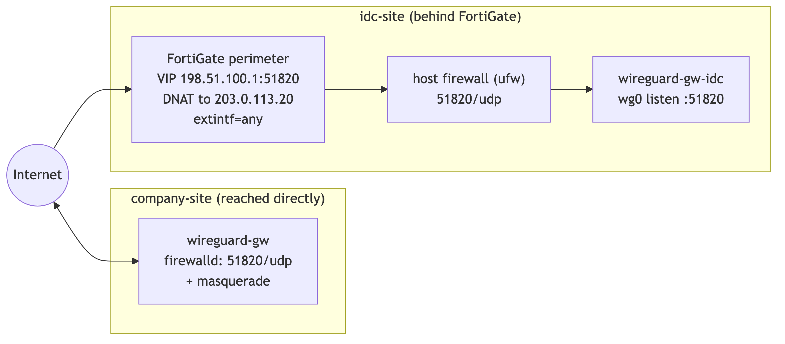

# Architecture Overview

> 한국어: [`docs/ko/architecture-overview.md`](../ko/architecture-overview.md)

## Goal

Provide L3 reachability between two OpenStack-hosted Kubernetes clusters located at
separate physical sites, over a single encrypted WireGuard tunnel, **without**
running WireGuard on the worker nodes.

## Design principle: a dedicated gateway VM per site

Each site runs a **dedicated gateway VM** inside its OpenStack project to terminate
the tunnel. Using a physical / all-in-one host as the endpoint directly is avoided:
enabling IP forwarding and `MASQUERADE` on a host that also serves as an OpenStack
controller/compute node can interfere with existing cloud-internal traffic.

The gateway VM is isolated, disposable, and owns all NAT/forwarding state, so the
tunnel can be added or removed with zero impact on the rest of the cloud.

## Endpoints

| Role | Host | OS | Internal IP | Floating IP | WireGuard IP | Public reachability |
|------|------|----|-------------|-------------|--------------|---------------------|
| company-site | `wireguard-gw` | Rocky Linux 9 | `10.10.0.10` | `203.0.113.10` | `10.0.90.1/30` | **direct** on Floating IP |
| idc-site | `wireguard-gw-idc` | Ubuntu 24.04 | `10.20.0.10` | `203.0.113.20` | `10.0.90.2/30` | via **FortiGate VIP** `198.51.100.1` → DNAT |

- Tunnel subnet: `10.0.90.0/30`, WireGuard over **UDP/51820**
- Brought up via `systemd`: `wg-quick@wg0`

## Topology


## Worker join model (gateway model, not mesh)

Worker nodes do **not** run WireGuard. They reach the remote subnet via a single
static route to their local gateway:

- company-site host → `ip route 10.20.0.0/24 via 10.10.0.10`
- idc-site host → `ip route 10.10.0.0/24 via 10.20.0.10`

For the **return** direction, each gateway source-NATs (`MASQUERADE`) traffic that
arrives **from the remote subnet** onto its local LAN. The local destination host
then sees the gateway as the source and replies to it — no per-host return route
required.

Routes are best distributed via the OpenStack subnet `host_routes` attribute, so
every node receives them through DHCP rather than being configured individually.

## Asymmetric NAT traversal

The idc-site gateway sits behind a **FortiGate** firewall: it has no publicly
reachable WireGuard port until a VIP + firewall policy DNATs inbound UDP/51820 to
its Floating IP. The company-site gateway is reachable directly on its Floating IP.

> [!IMPORTANT]
> Because at least one side is always behind NAT, **`PersistentKeepalive = 25`** is
> mandatory on both peers. Without it the NAT session expires and the tunnel works
> in one direction only.

## Firewall layers

Three layers must allow the tunnel:

| Layer | Where | Change |
|-------|-------|--------|
| Perimeter | FortiGate (idc-site) | VIP `198.51.100.1:51820` → `203.0.113.20:51820`; policy `extintf=any`, UDP/51820 ACCEPT |
| Host (company) | Rocky 9 `firewalld` | `--add-port=51820/udp` + `--add-masquerade` |
| Host (idc) | Ubuntu `ufw` / iptables | `ufw allow 51820/udp`; `MASQUERADE` via `wg0.conf` PostUp |



See [`configs/fortigate/dnat-vip.md`](../../configs/fortigate/dnat-vip.md) for the
FortiGate objects.

## Automation

The gateway build is captured as an Ansible role so it is reproducible and
idempotent:

- install `wireguard-tools` (apt/dnf branch)
- render `wg0.conf` from a Jinja2 template, with per-site values in `group_vars`
- apply `net.ipv4.ip_forward=1` via sysctl
- `systemctl enable --now wg-quick@wg0`

## Validation

The reference deployment was validated end to end:

| Check | Result |
|-------|--------|
| `wg show` handshake (both peers) | PASS — bidirectional transfer |
| Bidirectional ping | PASS — 3–5 ms, 0% loss |
| SSH across the tunnel | PASS |
| HTTPS service (Keystone API) | PASS — HTTP 200 |
| HTTPS service (K8s API) | PASS — TLS established |

Re-run these checks any time with `wg show`, `ping`, and `curl` — see
[Troubleshooting › Verification commands](troubleshooting.md).

## High availability (optional extension)

The single-gateway design can be extended to an HA pair per site using HAProxy +
VRRP in front of the gateways. Out of scope for this baseline, but the addressing
plan leaves room for a virtual gateway IP.

## Rollback

WireGuard runs on an independent path; tearing it down does not affect existing
public-IP access:

```bash
systemctl disable --now wg-quick@wg0
rm -f /etc/wireguard/wg0.conf /etc/sysctl.d/99-wireguard.conf
sysctl --system
```

## Related docs

- [Network topology & addressing](network-topology.md)
- [Packet flow walk-through](packet-flow.md)
- [Troubleshooting](troubleshooting.md)
