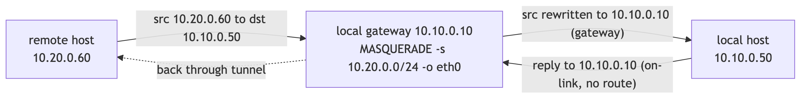

# Network Topology & Addressing

> 한국어: [`docs/ko/network-topology.md`](../ko/network-topology.md)

## Address plan

| Segment | CIDR / IP | Notes |
|---------|-----------|-------|
| company-site internal | `10.10.0.0/24` | K8s workers + gateway `eth0` |
| idc-site internal | `10.20.0.0/24` | K8s workers + gateway `ens3` |
| WireGuard tunnel | `10.0.90.0/30` | point-to-point, 2 usable addresses |
| company gateway tunnel IP | `10.0.90.1/30` | `wg0` on `wireguard-gw` |
| idc gateway tunnel IP | `10.0.90.2/30` | `wg0` on `wireguard-gw-idc` |
| company Floating IP | `203.0.113.10` | direct WireGuard endpoint |
| idc Floating IP | `203.0.113.20` | DNAT target behind FortiGate |
| FortiGate public IP | `198.51.100.1` | VIP fronting the idc gateway |

## Logical topology


## Route design

### Gateways

Each gateway advertises (via `AllowedIPs`) and routes its own site subnet plus the
peer tunnel address; `wg-quick` installs routes for the configured `AllowedIPs`
automatically.

- company peer `AllowedIPs`: `10.0.90.2/32, 10.20.0.0/24`
- idc peer `AllowedIPs`: `10.0.90.1/32, 10.10.0.0/24`

### Hosts / workers

A host needs **one** static route to the remote subnet via the local gateway —
required only on hosts that *initiate* toward the remote site:

```bash
# company-site host
ip route add 10.20.0.0/24 via 10.10.0.10

# idc-site host
ip route add 10.10.0.0/24 via 10.20.0.10
```

Persist on Rocky Linux / NetworkManager:

```bash
nmcli con mod <connection> +ipv4.routes "10.20.0.0/24 10.10.0.10"
nmcli con up <connection>
```

> [!TIP]
> Push routes fleet-wide through OpenStack instead of per node:
> ```bash
> openstack subnet set --host-route destination=10.20.0.0/24,gateway=10.10.0.10 <subnet>
> # nodes pick it up on next DHCP renew / reboot
> ```

## Source NAT (return path)

Each gateway source-NATs traffic **arriving from the remote subnet** as it forwards
it onto the local LAN. The local destination host then sees the gateway as the
source and replies to it — so destination hosts need no return route.

```
company gw (eth0):  -s 10.0.90.0/30 -j MASQUERADE ; -s 10.20.0.0/24 -j MASQUERADE
idc gw     (ens3):  -s 10.0.90.0/30 -j MASQUERADE ; -s 10.10.0.0/24 -j MASQUERADE
```



> [!NOTE]
> The masqueraded source is the **remote** subnet (and the tunnel `/30`), not the
> gateway's own subnet — this is what lets the reply find its way back through the
> gateway. Full `PostUp`/`PreDown` rules are in
> [`configs/wireguard/`](../../configs/wireguard).
