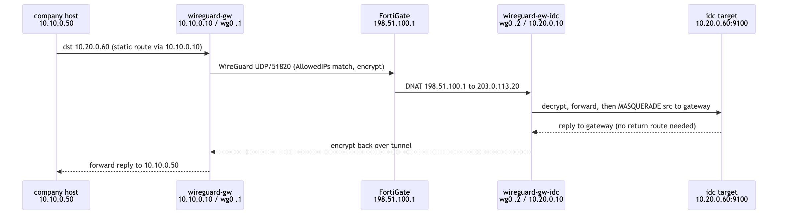
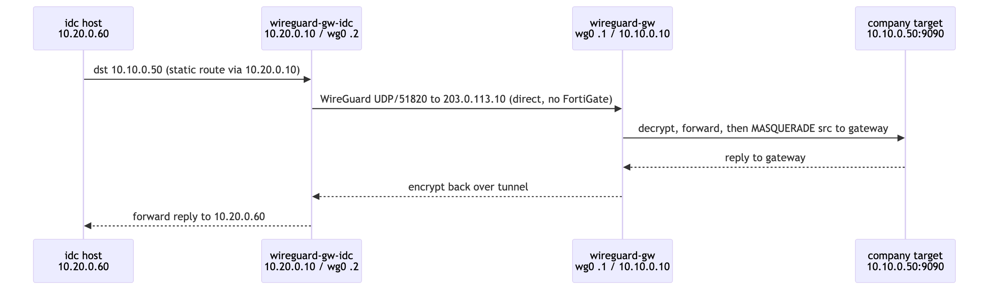

# Packet Flow Walk-through

> 한국어: [`docs/ko/packet-flow.md`](../ko/packet-flow.md)

Two representative flows, one in each direction. The company-site gateway is
reachable directly; the idc-site gateway is reached through the FortiGate VIP.

---

## Flow 1 — company-site → idc-site

Example: a monitoring server at company-site scrapes a target at idc-site
(`10.10.0.50` → `10.20.0.60:9100`).

1. **company host (`10.10.0.50`)** sends to `10.20.0.60`. Its static route
   `10.20.0.0/24 via 10.10.0.10` sends the packet to the local gateway.
2. **wireguard-gw** matches the destination against the peer `AllowedIPs`
   (`10.20.0.0/24`), so the kernel routes it into `wg0`; WireGuard encrypts it and
   sends UDP/51820 from `203.0.113.10` to `198.51.100.1:51820`.
3. **FortiGate** DNATs `198.51.100.1:51820` → `203.0.113.20:51820`.
4. **wireguard-gw-idc** decrypts; IP forwarding sends the inner packet onto the idc
   LAN. Its `MASQUERADE` rule (`-s 10.10.0.0/24 -o ens3`) rewrites the source to the
   gateway, so the target replies to the gateway.
5. The reply retraces the tunnel and **wireguard-gw** forwards it to `10.10.0.50`.

---

## Flow 2 — idc-site → company-site

Example: an idc K8s cluster remote-writes metrics to company-site
(`10.20.0.60` → `10.10.0.50:9090`).

1. **idc host (`10.20.0.60`)** sends to `10.10.0.50`; static route
   `10.10.0.0/24 via 10.20.0.10` sends it to the local gateway.
2. **wireguard-gw-idc** routes it into `wg0` (peer `AllowedIPs 10.10.0.0/24`),
   encrypts, and sends UDP/51820 **directly** to `203.0.113.10:51820` — the company
   gateway is not behind a FortiGate, so no DNAT hop.
3. **wireguard-gw** decrypts; IP forwarding sends it onto the company LAN. Its
   `MASQUERADE` rule (`-s 10.20.0.0/24 -o eth0`) rewrites the source to the gateway.
4. The target replies to the gateway, which retraces the tunnel back to
   `10.20.0.60`.

---

## Why source-NAT is what makes this work

Without `MASQUERADE`, the destination host would see the original remote source
(e.g. `10.10.0.50`) and try to reply using *its own* routing table — which has no
route back across the tunnel. Source-NAT rewrites the source to the local gateway,
which is on-link, so replies always return to the gateway and back through the
tunnel. This keeps the design robust without needing return routes on every host.

## NAT keepalive

The idc endpoint lives behind FortiGate NAT, so the return UDP mapping only stays
open while traffic flows. `PersistentKeepalive = 25` on both peers sends a small
packet every 25 s to hold the NAT pinhole open, preventing a one-way tunnel after
idle periods.
