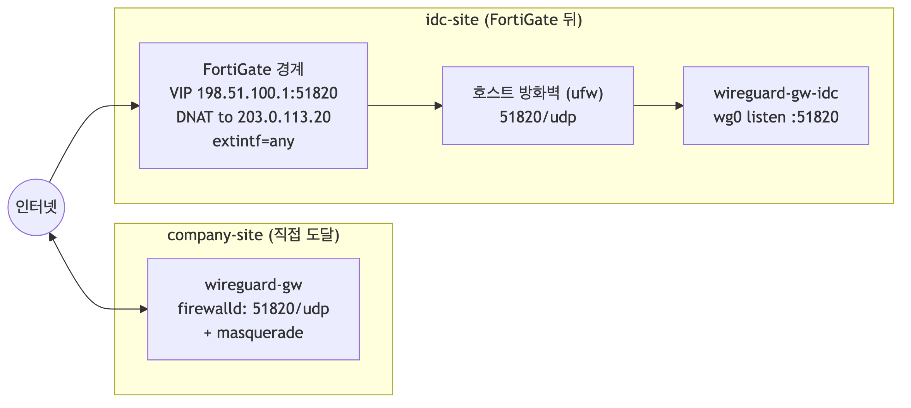

# 아키텍처 개요

> English: [`docs/en/architecture-overview.md`](../en/architecture-overview.md)

## 목표

서로 다른 물리 사이트에 위치한 두 OpenStack 기반 Kubernetes 클러스터 사이를,
**워커 노드에는 WireGuard를 설치하지 않고** 단일 암호화 WireGuard 터널로 L3
도달성을 제공하는 것이 목표입니다.

## 설계 원칙: 사이트별 전용 게이트웨이 VM

각 사이트는 OpenStack 프로젝트 내부에 **전용 게이트웨이 VM**을 두어 터널을
종단합니다. 물리/올인원 호스트를 직접 엔드포인트로 쓰지 않는 이유는, OpenStack
컨트롤러/컴퓨트를 겸하는 호스트에 IP forwarding과 `MASQUERADE`를 켜면 기존
클라우드 내부 트래픽에 영향을 줄 수 있기 때문입니다.

게이트웨이 VM은 격리되어 있고 폐기가 쉬우며 모든 NAT/forwarding 상태를 소유합니다.
따라서 클라우드의 나머지 부분에 영향을 주지 않고 터널을 추가하거나 제거할 수
있습니다.

## 엔드포인트

| 역할 | 호스트 | OS | 내부 IP | Floating IP | WireGuard IP | 공개 도달 |
|------|--------|----|---------|-------------|--------------|-----------|
| company-site | `wireguard-gw` | Rocky Linux 9 | `10.10.0.10` | `203.0.113.10` | `10.0.90.1/30` | Floating IP로 **직접** |
| idc-site | `wireguard-gw-idc` | Ubuntu 24.04 | `10.20.0.10` | `203.0.113.20` | `10.0.90.2/30` | **FortiGate VIP** `198.51.100.1` → DNAT |

- 터널 서브넷은 `10.0.90.0/30`이며, WireGuard는 **UDP/51820**으로 동작합니다.
- 기동은 `systemd`(`wg-quick@wg0`)로 합니다.

## 토폴로지


## 워커 조인 모델 (메시가 아닌 게이트웨이 모델)

워커 노드는 WireGuard를 **실행하지 않습니다**. 대신 로컬 게이트웨이를 향한 단일
static route로 원격 서브넷에 도달합니다.

- company-site 호스트 → `ip route 10.20.0.0/24 via 10.10.0.10`
- idc-site 호스트 → `ip route 10.10.0.0/24 via 10.20.0.10`

**리턴** 방향에서는, 각 게이트웨이가 **원격 서브넷에서 들어온** 트래픽을 로컬
LAN으로 내보낼 때 source-NAT(`MASQUERADE`)를 적용합니다. 그러면 로컬 목적지
호스트는 게이트웨이를 소스로 보고 게이트웨이에 응답하므로, 호스트마다 리턴 라우트를
둘 필요가 없습니다.

라우트는 OpenStack 서브넷 `host_routes` 속성으로 배포하는 방법을 권장합니다. 이렇게
하면 노드를 하나씩 설정하지 않고 DHCP로 전 노드에 전달할 수 있습니다.

## 비대칭 NAT 통과

idc-site 게이트웨이는 **FortiGate** 방화벽 뒤에 있습니다. VIP + 방화벽 정책으로
인바운드 UDP/51820을 Floating IP로 DNAT하기 전까지는 공개 도달 가능한 WireGuard
포트가 없습니다. 반면 company-site 게이트웨이는 Floating IP로 직접 도달할 수
있습니다.

> [!IMPORTANT]
> 적어도 한쪽은 항상 NAT 뒤에 있으므로, 양쪽 peer에 **`PersistentKeepalive = 25`**가
> 필요합니다. 설정하지 않으면 NAT 세션이 만료되어 터널이 단방향으로만 동작합니다.

## 방화벽 계층

터널이 통하려면 다음 3개 계층이 모두 허용해야 합니다.

| 계층 | 위치 | 변경 |
|------|------|------|
| 경계 | FortiGate (idc-site) | VIP `198.51.100.1:51820` → `203.0.113.20:51820`; 정책 `extintf=any`, UDP/51820 ACCEPT |
| 호스트 (company) | Rocky 9 `firewalld` | `--add-port=51820/udp` + `--add-masquerade` |
| 호스트 (idc) | Ubuntu `ufw` / iptables | `ufw allow 51820/udp`; `MASQUERADE`는 `wg0.conf` PostUp |



FortiGate 객체는 [`configs/fortigate/dnat-vip.md`](../../configs/fortigate/dnat-vip.md)를
참고해 주세요.

## 자동화

게이트웨이 구축은 재현 가능하고 멱등하도록 Ansible 롤로 관리합니다.

- `wireguard-tools` 설치 (apt/dnf 분기)
- `wg0.conf`를 Jinja2 템플릿으로 렌더링하고, 사이트별 값은 `group_vars`로 분리
- `net.ipv4.ip_forward=1` sysctl 적용
- `systemctl enable --now wg-quick@wg0`

## 검증

레퍼런스 배포는 end-to-end로 검증했습니다.

| 항목 | 결과 |
|------|------|
| `wg show` 핸드셰이크 (양 peer) | PASS — 양방향 전송 |
| 양방향 ping | PASS — 3–5ms, 0% loss |
| 터널 경유 SSH | PASS |
| HTTPS 서비스 (Keystone API) | PASS — HTTP 200 |
| HTTPS 서비스 (K8s API) | PASS — TLS 수립 |

`wg show`/`ping`/`curl`로 언제든 다시 검증할 수 있습니다 —
[트러블슈팅 › 검증 명령](troubleshooting.md)을 참고해 주세요.

## 롤백

WireGuard는 독립 경로로 동작하므로, 철거해도 기존 공인 IP 접근에는 영향이 없습니다.

```bash
systemctl disable --now wg-quick@wg0
rm -f /etc/wireguard/wg0.conf /etc/sysctl.d/99-wireguard.conf
sysctl --system
```

## 관련 문서

- [네트워크 토폴로지 & 주소 계획](network-topology.md)
- [패킷 흐름 추적](packet-flow.md)
- [트러블슈팅](troubleshooting.md)
