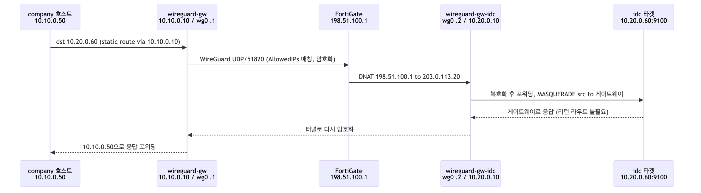
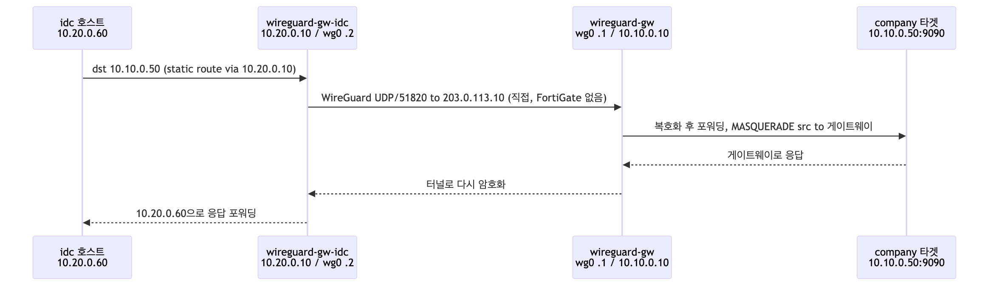

# 패킷 흐름 추적

> English: [`docs/en/packet-flow.md`](../en/packet-flow.md)

방향별 대표 흐름 2가지를 살펴봅니다. company-site 게이트웨이는 직접 도달하고,
idc-site 게이트웨이는 FortiGate VIP를 통해 도달합니다.

---

## 흐름 1 — company-site → idc-site

예시: company-site 모니터링 서버가 idc-site 타겟을 스크레이프하는 경우입니다
(`10.10.0.50` → `10.20.0.60:9100`).

1. **company 호스트(`10.10.0.50`)**가 `10.20.0.60`으로 패킷을 보냅니다. static route
   `10.20.0.0/24 via 10.10.0.10`에 따라 로컬 게이트웨이로 향합니다.
2. **wireguard-gw**가 목적지를 peer `AllowedIPs`(`10.20.0.0/24`)와 매칭하면 커널이
   `wg0`로 라우팅합니다. WireGuard가 암호화한 뒤 `203.0.113.10`에서
   `198.51.100.1:51820`으로 UDP/51820을 전송합니다.
3. **FortiGate**가 `198.51.100.1:51820`을 `203.0.113.20:51820`으로 DNAT합니다.
4. **wireguard-gw-idc**가 복호화합니다. IP forwarding으로 내부 패킷을 idc LAN에
   전달하며, `MASQUERADE` 룰(`-s 10.10.0.0/24 -o ens3`)이 소스를 게이트웨이로
   치환하므로 타겟은 게이트웨이에 응답합니다.
5. 응답은 터널을 되짚어 돌아오고, **wireguard-gw**가 `10.10.0.50`으로 포워딩합니다.

---

## 흐름 2 — idc-site → company-site

예시: idc K8s 클러스터가 company-site로 메트릭을 remote-write하는 경우입니다
(`10.20.0.60` → `10.10.0.50:9090`).

1. **idc 호스트(`10.20.0.60`)**가 `10.10.0.50`으로 패킷을 보냅니다. static route
   `10.10.0.0/24 via 10.20.0.10`에 따라 로컬 게이트웨이로 향합니다.
2. **wireguard-gw-idc**가 `wg0`로 라우팅하고(peer `AllowedIPs 10.10.0.0/24`)
   암호화한 뒤 `203.0.113.10:51820`으로 **직접** UDP/51820을 전송합니다. company
   게이트웨이는 FortiGate 뒤에 있지 않으므로 DNAT 홉이 없습니다.
3. **wireguard-gw**가 복호화합니다. IP forwarding으로 company LAN에 전달하며,
   `MASQUERADE` 룰(`-s 10.20.0.0/24 -o eth0`)이 소스를 게이트웨이로 치환합니다.
4. 타겟이 게이트웨이에 응답하면, 게이트웨이가 터널을 되짚어 `10.20.0.60`으로
   돌려보냅니다.

---

## 왜 source-NAT가 동작의 핵심인가

`MASQUERADE`가 없으면 목적지 호스트는 원래의 원격 소스(예: `10.10.0.50`)를 보고
*자신의* 라우팅 테이블로 응답하려고 합니다. 그런데 터널로 되돌아갈 라우트가 없습니다.
source-NAT는 소스를 on-link인 로컬 게이트웨이로 치환하므로, 응답은 항상 게이트웨이로
향하고 다시 터널을 거쳐 돌아옵니다. 덕분에 모든 호스트에 리턴 라우트를 두지 않아도
설계가 견고하게 동작합니다.

## NAT keepalive

idc 엔드포인트가 FortiGate NAT 뒤에 있으므로, 리턴 UDP 매핑은 트래픽이 흐르는 동안만
유지됩니다. 양쪽 peer의 `PersistentKeepalive = 25`가 25초마다 작은 패킷을 보내 NAT
핀홀을 열어 두므로, 유휴 상태가 이어져도 단방향 터널이 되는 것을 막아 줍니다.
